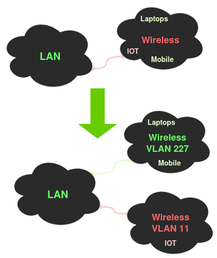

# Turning an Asus Router to a VLAN aware Access Point


## Steps

- Install [Asus-Merlin](https://www.asuswrt-merlin.net/) on the router
- Set the router to AP mode
- Enable Administration > System > Enable JFFS custom scripts and configs
- Set the router to a static IP instead of DHCP
- Create all needed guest networks, in this example there will be Guest 2.5Ghz and Guest 5Ghz
- Save the script to `/jffs/scripts/services-start` after it's done
- Set `chmod a+x /jffs/scripts/services-start`
- Reboot the router to apply changes

## Discovery

Before editing the script we need to figure out the interface names, disconnect all ethernet cables except one and run `ip a` to check which interface is UP, keep switching between ports and running  `ip a` to map all ports.

For example:

- eth0 - LAN 1
- eth1 - LAN 2
- eth2 - LAN 3
- eth3 - LAN 4
- eth4 - WAN
- eth5 - Main wifi 2.5Ghz
- eth6 - Main wifi 5Ghz
- wl0.1 - Guest wifi 2.4Ghz
- wl1.1 - Guest wifi 5Ghz

## Script

The following script assumes the layout above and creates 2 VLANs:

1. 227 - LAN ports 1-4, Main wifi 2.5Ghz, Main wifi 5Ghz
2. 11 (with client isolation) - Guest wifi 2.5Ghz, Guest wifi 5Ghz

Change the script according to your router model's layout and needs.

```bash
#!/bin/sh

brctl delif br0 eth4
brctl delif br0 wl0.1
brctl delif br0 wl1.1
ip link add link eth4 name eth4.227 type vlan id 227
ip link add link eth4 name eth4.11 type vlan id 11
ip link set eth4.227 up
ip link set eth4.11 up
brctl addif br0 eth4.227
brctl addbr br1
brctl addif br1 eth4.11
brctl addif br1 wl0.1
brctl addif br1 wl1.1
ip link set br1 up
nvram set lan_ifnames="eth0 eth1 eth2 eth3 eth5 eth6 eth4.227"
nvram set lan1_ifnames="wl0.1 wl1.1 eth4.11"
nvram set lan1_ifname="br1"
nvram set br0_ifnames="eth0 eth1 eth2 eth3 eth5 eth6 eth4.227"
nvram set br1_ifnames="wl0.1 wl1.1 eth4.11"
nvram set br1_ifname="br1"
nvram set wl0.1_ap_isolate="1"
nvram set wl1.1_ap_isolate="1"
killall eapd
eapd
ethswctl -c hw-switch
```

## Recovery

If the router doesn't boot after making the changes, you can revert it to factory defaults on most models:

1. Power off the router
2. Hold the WDS button on the back
3. Turn the router on while still holding the WDS button
4. Wait for the power led to turn off
5. Reboot the router normally